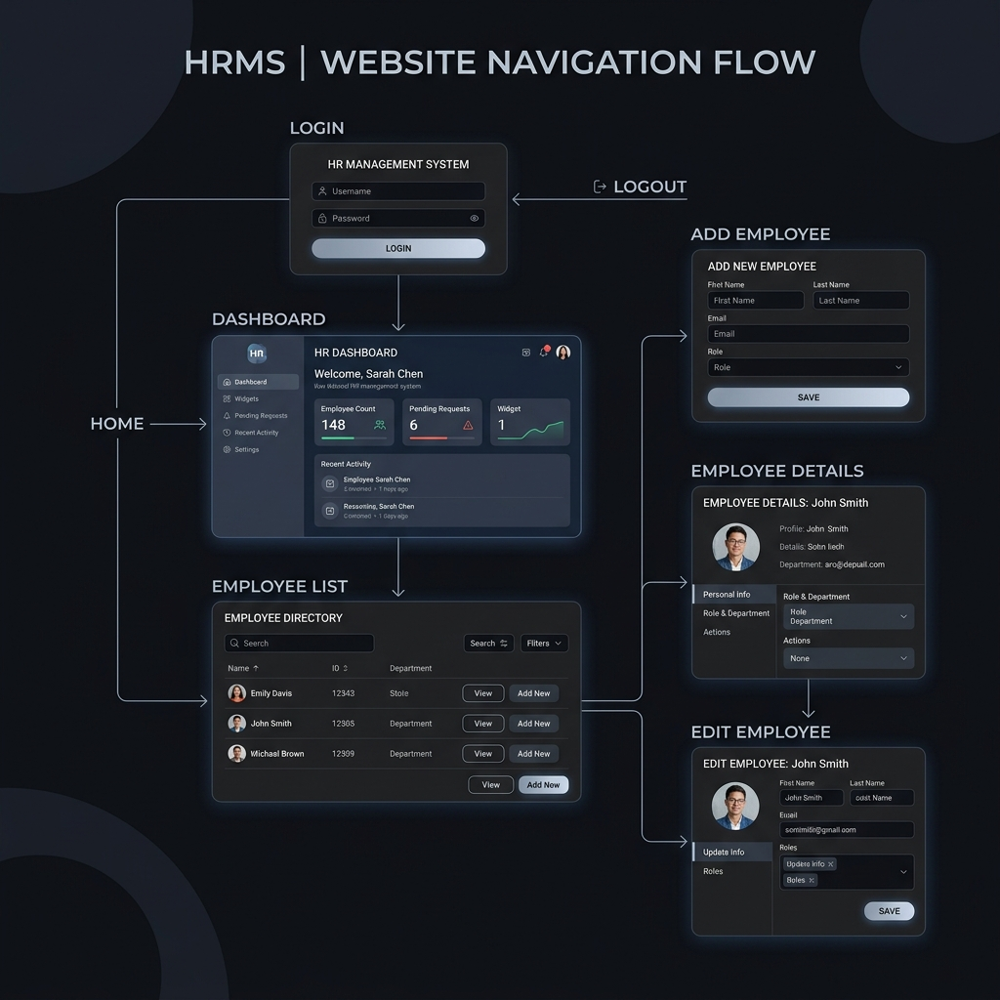
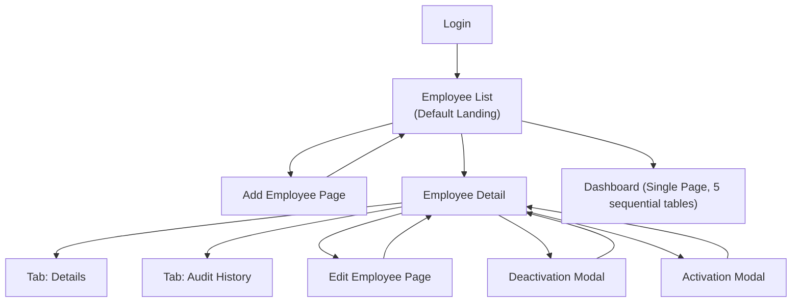

# SalaryHub — Design System & Wireframes (v2.2)

> **Version**: 2.2  
> **Date**: 2026-05-25  
> **Status**: Approved (Updated post-implementation)  
> **Source**: [Product Requirements](../../PRODUCT_REQUIREMENTS.md)

---

## Changes in Final Implementation

| # | Change | Rationale |
|---|--------|-----------|
| 1 | **Employee List is the default landing page** after login | CRUD is the primary workflow for HR managers. |
| 2 | **Audit Trail is a client-side tab** within Employee Detail | Keeps audit context close to the employee it belongs to. |
| 3 | **Sidebar nav has 2 items**: Dashboard (`/dashboard`), Employees (`/employees`) | Simple navigation for the core features. |
| 4 | **Single Full Name Field** | First Name and Last Name were merged into a single `fullName` field on both users and employees for easier layout management. |
| 5 | **State is now mandatory** | Added a required `state` field for employee addresses alongside `city` and `country`. |
| 6 | **2-Character Country Codes** | Country input uses standard 2-character ISO codes (e.g. `IN`, `US`, `GB`). The frontend automatically translates these to names for display and derives local currencies (INR, USD, GBP, EUR, JPY) based on selected country. |
| 7 | **Dashboard is sequential cards (no tabs)** | To make report data scannable on a single scroll, the dashboard renders 5 distinct metrics cards sequentially, removing the client-side dashboard tabs. |
| 8 | **Activation capability added** | Added an Activation Modal and header action on the employee detail page to allow reactivating soft-deleted profiles. |
| 9 | **Actions in Employee Table simplified** | The Employee List row actions only show View (Eye) and Edit (Pencil). Deactivate and Activate flows are handled in the detail view. Status is shown as a simple green/red dot in the Name column. |
| 10 | **Omitted Gender Pay tables** | Simplified analytical dashboards by focusing on Headcount and average salaries per Country, Department, and Job Title (pivot format). |

---

## Table of Contents

1. [Design Philosophy](#design-philosophy)
2. [Color System](#color-system)
3. [Typography](#typography)
4. [Spacing & Layout](#spacing--layout)
5. [Component Library](#component-library)
6. [Iconography](#iconography)
7. [Screen Wireframes](#screen-wireframes)
8. [Interaction Patterns](#interaction-patterns)
9. [Responsive Strategy](#responsive-strategy)
10. [Accessibility](#accessibility)

---

## Design Philosophy

| Principle | Description |
|-----------|-------------|
| **Clarity** | HR managers deal with sensitive salary data — every screen communicates information hierarchy instantly. |
| **Efficiency** | Minimize clicks. Common actions (filter, sort) are ≤ 1 click from the list view. |
| **Trust** | Audit trail visibility builds confidence. Shows "who changed what and why" in expandable rows. |
| **Dark-first** | A modern dark theme reduces eye strain during long data-entry sessions and provides visual sophistication. |
| **Data density** | Dashboards pack information without overwhelming — utilizes pivot grids for country-level breakdowns. |
| **Tables over charts** | Precise numbers in well-structured tables are more actionable for HR than visual charts. |

---

## Color System

### Core Palette

| Token | Hex | Usage |
|-------|-----|-------|
| `--bg-primary` | `#0F1117` | Page background, deepest layer |
| `--bg-secondary` | `#161922` | Sidebar, card backgrounds |
| `--bg-elevated` | `#1E2230` | Modals, dropdowns, hover states |
| `--bg-surface` | `#252A3A` | Table rows (alt), input fields |
| `--border-subtle` | `#2E3447` | Card borders, dividers |
| `--border-focus` | `#6366F1` | Focus rings, active borders |

### Text

| Token | Hex | Usage |
|-------|-----|-------|
| `--text-primary` | `#F1F5F9` | Headings, primary content |
| `--text-secondary` | `#94A3B8` | Labels, secondary info, timestamps |
| `--text-muted` | `#64748B` | Placeholders, disabled text |
| `--text-inverse` | `#0F1117` | Text on light/colored backgrounds |

### Accent / Brand

| Token | Hex | Usage |
|-------|-----|-------|
| `--accent-primary` | `#6366F1` | Primary buttons, active nav items, links |
| `--accent-primary-hover` | `#818CF8` | Hover state for primary accent |
| `--accent-gradient` | `linear-gradient(135deg, #6366F1, #8B5CF6)` | CTA buttons, hero elements |

### Semantic

| Token | Hex | Usage |
|-------|-----|-------|
| `--success` | `#22C55E` | Active badges, create icons, positive delta |
| `--success-muted` | `rgba(34,197,94,0.15)` | Success badge background |
| `--warning` | `#F59E0B` | Warnings, caution banners |
| `--warning-muted` | `rgba(245,158,11,0.15)` | Warning badge background |
| `--danger` | `#EF4444` | Delete actions, error states, destructive buttons |
| `--danger-muted` | `rgba(239,68,68,0.15)` | Danger badge background |
| `--info` | `#3B82F6` | Update icons, informational banners |
| `--info-muted` | `rgba(59,130,246,0.15)` | Info badge background |

---

## Typography

**Font Family**: `'Inter', -apple-system, BlinkMacSystemFont, 'Segoe UI', sans-serif`  
**Monospace**: `'JetBrains Mono', 'Fira Code', monospace` — for employee codes, salary numbers

### Type Scale

| Token | Size | Weight | Line Height | Usage |
|-------|------|--------|-------------|-------|
| `--text-display` | 32px | 700 | 1.2 | Dashboard headline numbers |
| `--text-h1` | 24px | 600 | 1.3 | Page titles |
| `--text-h2` | 20px | 600 | 1.35 | Section headings, card headings |
| `--text-h3` | 16px | 600 | 1.4 | Card titles, sub-sections |
| `--text-body` | 14px | 400 | 1.5 | Body text, table cells |
| `--text-body-medium` | 14px | 500 | 1.5 | Table headers, labels |
| `--text-small` | 12px | 400 | 1.5 | Captions, timestamps, helper text |
| `--text-tiny` | 11px | 500 | 1.4 | Badges, tags |

---

## Spacing & Layout

### Spacing Scale (8px base)

| Token | Value | Usage |
|-------|-------|-------|
| `--space-1` | 4px | Inline icon gaps |
| `--space-2` | 8px | Tight padding (badges, tags) |
| `--space-3` | 12px | Input internal padding |
| `--space-4` | 16px | Card padding, row gaps |
| `--space-5` | 20px | Section spacing |
| `--space-6` | 24px | Component group margins |
| `--space-8` | 32px | Page section separators |
| `--space-10` | 40px | Major layout gaps |

### Border Radius

| Token | Value | Usage |
|-------|-------|-------|
| `--radius-sm` | 4px | Badges, tags |
| `--radius-md` | 8px | Buttons, inputs |
| `--radius-lg` | 12px | Cards, modals |
| `--radius-xl` | 16px | Large cards, popovers |
| `--radius-full` | 9999px | Avatars, pill badges |

### Layout Grid

| Property | Value |
|----------|-------|
| Sidebar width | 240px |
| Max content width | 1280px |
| Page horizontal padding | 32px (desktop), 16px (mobile) |
| Table min-width | 1024px (horizontal scroll below) |

---

## Component Library

### Buttons

| Variant | Background | Text | Border | Usage |
|---------|-----------|------|--------|-------|
| **Primary** | `--accent-gradient` | `--text-primary` | none | "Add Employee", "Save", main CTAs |
| **Secondary** | transparent | `--text-primary` | `1px solid --border-subtle` | "Cancel", filter panel toggles |
| **Danger** | `--danger` | white | none | "Confirm Deactivation" |
| **Danger Outline** | transparent | `--danger` | `1px solid --danger` | "Deactivate" in detail view |
| **Success Outline** | transparent | `--success` | `1px solid --success` | "Activate" in detail view |
| **Ghost** | transparent | `--text-secondary` | none | Icon-only actions in tables |

---

## Iconography

**Icon Set**: Lucide Icons

| Action | Icon | Context |
|--------|------|---------|
| View | `Eye` | Table row action |
| Edit | `Edit2` / `Pencil` | Table row action, detail page |
| Deactivate | `UserMinus` | Detail view action |
| Activate | `UserCheck` | Detail view action |
| Add | `Plus` | "Add Employee" button |
| Filter | `SlidersHorizontal` | Filter panel toggle |
| Export | `Download` | CSV Export |
| Dashboard | `LayoutDashboard` | Sidebar nav |
| Employees | `Users` | Sidebar nav |
| Clock | `Clock` | Audit logs history timestamps |

---

## Screen Wireframes

### Application Structure Overview

Show Mermaid Source

**Total Screens**: 7 (Login, Employee List, Add Employee, Employee Detail, Edit Employee, Dashboard, Modals)

---

### Screen 1: Login

- **Route**: `/login`
- **Wordmark**: "SalaryHub"
- **Form Card**: Requires Email Address (Mail prefix) and Password (Lock prefix, visibility toggle).
- **CTA**: "Sign In" button (Primary). Redirection lands on the **Employee List**.

---

### Screen 2: Employee List (Default Landing Page)

- **Route**: `/employees`
- **Page Header**: Title "Employees", subtitle, "Add Employee" button (Primary + Plus icon).
- **Filter panel**: Collapsible. Dropdowns for Department, Country (ISO codes), Gender, Employment Type, Status (Active/Inactive/All). "Clear Filters" button.
- **Table Columns**:
  1. **Code**: `employeeCode` (e.g. `EMP-0001`, monospace font).
  2. **Employee**: Displays full name and email. Has a status dot indicator (🟢 for Active, 🔴 for Inactive) prefixing the name.
  3. **Department**: Department name from the lookups.
  4. **Location**: Combines city, state, and country name (e.g., `Bangalore, Karnataka, India`).
  5. **Gender**: Readable string text.
  6. **Emp. Type**: Formatted text badge.
  7. **Job Title**: Title from lookup.
  8. **Salary (USD)**: Formatted currency representation of `salaryUsd`.
  9. **Actions**: Row-level buttons for View (Eye) and Edit (Pencil).
- **Pagination**: Centered controls with page size limits (10/25/50/100) and page navigation numbers.

---

### Screen 3: Add Employee

- **Route**: `/employees/add`
- **Layout**: Full-page forms divided into sectioned cards:
  - **Personal Information**: Full Name*, Email*, Phone*, Gender*, Date of Birth*.
  - **Employment Details**: Hire Date*, Department* (lookup), Job Title* (lookup), Country* (2-character ISO dropdown), City*, State*.
  - **Compensation**: Local Salary* (accompanied by a read-only currency label derived from country code e.g. selecting country `IN` locks the label to `INR`), USD Salary*.
- **Actions**: "Cancel" (redirects back to list) | "Save Employee" (Primary).

---

### Screen 4: Employee Detail (with Tabs)

- **Route**: `/employees/:id`
- **Header**: Breadcrumbs, Employee Avatar (initials), Name, Active status badge, Code/Job/Dept summary row.
- **Actions**:
  - For active profiles: "Deactivate" (Danger Outline) and "Edit Profile" (Primary).
  - For inactive profiles: "Activate" (Success Outline) and "Edit Profile" (Primary).
- **Tabs**:
  - **Employee Details Tab**: Renders cards for Personal Information, Employment Details, and Compensation. If the employee is inactive, a dedicated red card for "Deactivation Details" is shown, detailing "Deactivated On" date and the "Deactivation Reason".
  - **Audit History Tab**: Renders the scoped `AuditHistoryTab` table.

#### Audit History Tab Table
Renders a data grid with the following columns:
- **Date & Time**: Formatted log timestamp.
- **Change Type**: Styled badges: Created (green), Updated (blue), or Deleted (red).
- **Changed By**: Display name (fullName) of the user who triggered the mutation.
- **Reason**: The change reason text entered.
- **Expandable row**: Clicking a row slides down to reveal a detailed diff grid:
  - Fields: Name of the attribute (formatted cleanly, e.g. `salary_local` -> `Local Salary`).
  - Old Value: Field state before update (or null for CREATED).
  - New Value: Updated field state.

---

### Screen 5: Edit Employee

- **Route**: `/employees/:id/edit`
- **Properties**: Same structure as the creation page, pre-filled with existing data. `email` and `employeeCode` are read-only and locked.
- **Change Reason**: Textarea field at the bottom labeled "Reason for Change *" is mandatory. Form cannot be saved if this is empty.

---

### Screen 6: Deactivation Modal

- **Trigger**: Clicked "Deactivate" on details view.
- **Form**:
  - Warning alert banner.
  - Reason dropdown* (Options: Resigned, Terminated, End of Contract).
  - Additional notes textarea (Optional).
- **Submission**: Sends `deactivation_reason` and `deactivated_on` (current date) to `DELETE /employees/:id`. Notes are mapped to the audit trail `change_reason`.

---

### Screen 7: Activation Modal

- **Trigger**: Clicked "Activate" on details view.
- **Form**:
  - Prompt confirming reactivation of the profile.
  - Reason for Reactivation notes textarea (Optional).
- **Submission**: Sends `isActive: true` and `changeReason` (or converted snake_case variables) to `PUT /employees/:id` which reactivates the employee profile.

---

### Screen 8: Dashboard

- **Route**: `/dashboard`
- **Design**: Single page rendering 5 visual cards with analytical tables computed from active employee records only:

1. **Salary Summary by Country**
   - Columns: Country Name, Headcount, Avg Salary, Min Salary, Max Salary (all figures in USD).
2. **Average Salary by Department**
   - Columns: Department, Headcount, Avg Salary (USD).
3. **Average Salary by Job Title**
   - Columns: Job Title, Headcount, Avg Salary (USD).
4. **Average Salary by Department & Country**
   - Pivot table showing Countries as rows and active Departments as columns. Cell displays Avg Salary (USD) and headcount (e.g. `$95,000 / 8 employees`).
5. **Average Salary by Job Title & Country**
   - Pivot table showing Countries as rows and active Job Titles as columns. Cell displays Avg Salary (USD) and headcount.

---

## Interaction Patterns

- **Loading States**: Full-page skeleton screens and spinner components. Button is replaced with a spinner and disabled during submissions.
- **CORS Handling**: Client maps credentials and requests transparently to the backend. Automatically redirects to `/login?expired=true` if API client intercepts a 401 unauthorized status.
- **Camel/Snake Mapping**: Client-side network interceptor converts JS camelCase variables to Sequelize-friendly snake_case parameters on request, and maps them back to camelCase on response.

---

## Responsive Strategy

- **Desktop (≥1280px)**: Left-hand navigation sidebar (240px) is visible, dashboard pivot tables display full grid columns.
- **Tablet (768px-1023px)**: Sidebar collapses to icon-only view. Page grids stack, tables scroll horizontally.
- **Mobile (<768px)**: Sidebar is hidden, replaced with a bottom navigation bar. Data tables transition to responsive card stacks, displaying employee info in a list of vertical items.
