# SalaryHub — Design System & Wireframes (v2.1)

> **Version**: 2.1  
> **Date**: 2026-05-21  
> **Status**: Approved  
> **Source**: [Product Requirements](../../PRODUCT_REQUIREMENTS.md)

---

## Changes from v1

| # | Change | Rationale |
|---|--------|-----------|
| 1 | **Employee List is the default landing page** after login | CRUD is the primary workflow for HR managers |
| 2 | **Audit Trail removed as standalone page** — now a client-side tab within Employee Detail | Keeps audit context close to the employee it belongs to |
| 3 | **Sidebar nav reduced to 2 items**: Dashboard, Employees | Simpler navigation, no orphaned audit page |
| 4 | **Currency dropdown removed** from Add/Edit forms — backend auto-determines currency from Country | Reduces input errors, one less field for HR to manage |
| 5 | **City is now mandatory** | Business requirement update |
| 6 | **Date of Birth is now mandatory** | Business requirement update |
| 7 | **Dashboard uses data tables** instead of charts | Tables provide clearer, more precise data for HR decision-making |
| 8 | **Deactivation Reason added as a column** in the employee table | Quick visibility of why employees were deactivated |
| 9 | **Responsive design** for mobile, tablet, and desktop (not desktop-only) | Full device compatibility from v1 |
| 10 | **Employee Detail uses client-side tabs**: Details + Audit History | Clean separation of current state vs. change history |
| 11 | **Deactivation modal free-form text** stored in `reason_for_change` in audit table | Leverages existing audit infrastructure |
| 12 | **No additional fields**: last pay review date, next pay review date, manager are explicitly out of scope | Keep v1 focused on core CRUD + analytics |
| 13 | **Dashboard tabs are client-side** (single route `/dashboard`) | Simpler routing, user preference |

---

## Table of Contents

1. [Design Philosophy](#design-philosophy)
2. [Color System](#color-system)
3. [Typography](#typography)
4. [Spacing & Layout](#spacing--layout)
5. [Component Library](#component-library)
6. [Iconography](#iconography)
7. [Screen Wireframes](#screen-wireframes)
8. [Interaction Patterns](#interaction-patterns)
9. [Responsive Strategy](#responsive-strategy)
10. [Accessibility](#accessibility)

---

## Design Philosophy

| Principle | Description |
|-----------|-------------|
| **Clarity** | HR managers deal with sensitive salary data — every screen must communicate information hierarchy instantly |
| **Efficiency** | Minimize clicks. Common actions (filter, sort, export) should be ≤ 1 click from the list view |
| **Trust** | Audit trail visibility builds confidence. Always show "who changed what and why" prominently |
| **Dark-first** | A modern dark theme reduces eye strain during long data-entry sessions and provides visual sophistication |
| **Data density** | Dashboards should pack information without overwhelming — progressive disclosure via tabs and accordions |
| **Tables over charts** | Precise numbers in well-structured tables are more actionable for HR than visual charts |

---

## Color System

### Core Palette

| Token | Hex | Usage |
|-------|-----|-------|
| `--bg-primary` | `#0F1117` | Page background, deepest layer |
| `--bg-secondary` | `#161922` | Sidebar, card backgrounds |
| `--bg-elevated` | `#1E2230` | Modals, dropdowns, hover states |
| `--bg-surface` | `#252A3A` | Table rows (alt), input fields |
| `--border-subtle` | `#2E3447` | Card borders, dividers |
| `--border-focus` | `#6366F1` | Focus rings, active borders |

### Text

| Token | Hex | Usage |
|-------|-----|-------|
| `--text-primary` | `#F1F5F9` | Headings, primary content |
| `--text-secondary` | `#94A3B8` | Labels, secondary info, timestamps |
| `--text-muted` | `#64748B` | Placeholders, disabled text |
| `--text-inverse` | `#0F1117` | Text on light/colored backgrounds |

### Accent / Brand

| Token | Hex | Usage |
|-------|-----|-------|
| `--accent-primary` | `#6366F1` | Primary buttons, active nav items, links |
| `--accent-primary-hover` | `#818CF8` | Hover state for primary accent |
| `--accent-gradient` | `linear-gradient(135deg, #6366F1, #8B5CF6)` | CTA buttons, hero elements |

### Semantic

| Token | Hex | Usage |
|-------|-----|-------|
| `--success` | `#22C55E` | Active badges, create icons, positive delta |
| `--success-muted` | `rgba(34,197,94,0.15)` | Success badge background |
| `--warning` | `#F59E0B` | Warnings, caution banners |
| `--warning-muted` | `rgba(245,158,11,0.15)` | Warning badge background |
| `--danger` | `#EF4444` | Delete actions, error states, destructive buttons |
| `--danger-muted` | `rgba(239,68,68,0.15)` | Danger badge background |
| `--info` | `#3B82F6` | Update icons, informational banners |
| `--info-muted` | `rgba(59,130,246,0.15)` | Info badge background |

### Gender-specific Colors (for Gender Pay tables)

| Token | Hex | Label |
|-------|-----|-------|
| `--gender-male` | `#3B82F6` | Male |
| `--gender-female` | `#EC4899` | Female |
| `--gender-other` | `#8B5CF6` | Other |
| `--gender-pnts` | `#64748B` | Prefer not to say |

---

## Typography

**Font Family**: `'Inter', -apple-system, BlinkMacSystemFont, 'Segoe UI', sans-serif`  
**Monospace**: `'JetBrains Mono', 'Fira Code', monospace` — for employee codes, salary numbers

### Type Scale

| Token | Size | Weight | Line Height | Usage |
|-------|------|--------|-------------|-------|
| `--text-display` | 32px | 700 | 1.2 | Dashboard headline numbers |
| `--text-h1` | 24px | 600 | 1.3 | Page titles |
| `--text-h2` | 20px | 600 | 1.35 | Section headings, tab labels |
| `--text-h3` | 16px | 600 | 1.4 | Card titles, sub-sections |
| `--text-body` | 14px | 400 | 1.5 | Body text, table cells |
| `--text-body-medium` | 14px | 500 | 1.5 | Table headers, labels |
| `--text-small` | 12px | 400 | 1.5 | Captions, timestamps, helper text |
| `--text-tiny` | 11px | 500 | 1.4 | Badges, tags |

---

## Spacing & Layout

### Spacing Scale (8px base)

| Token | Value | Usage |
|-------|-------|-------|
| `--space-1` | 4px | Inline icon gaps |
| `--space-2` | 8px | Tight padding (badges, tags) |
| `--space-3` | 12px | Input internal padding |
| `--space-4` | 16px | Card padding, row gaps |
| `--space-5` | 20px | Section spacing |
| `--space-6` | 24px | Component group margins |
| `--space-8` | 32px | Page section separators |
| `--space-10` | 40px | Major layout gaps |
| `--space-12` | 48px | Page-level top/bottom padding |

### Border Radius

| Token | Value | Usage |
|-------|-------|-------|
| `--radius-sm` | 4px | Badges, tags |
| `--radius-md` | 8px | Buttons, inputs |
| `--radius-lg` | 12px | Cards, modals |
| `--radius-xl` | 16px | Large cards, popovers |
| `--radius-full` | 9999px | Avatars, pill badges |

### Shadows

| Token | Value | Usage |
|-------|-------|-------|
| `--shadow-sm` | `0 1px 2px rgba(0,0,0,0.3)` | Subtle depth |
| `--shadow-md` | `0 4px 12px rgba(0,0,0,0.4)` | Cards, dropdowns |
| `--shadow-lg` | `0 8px 24px rgba(0,0,0,0.5)` | Modals, floating panels |
| `--shadow-glow` | `0 0 20px rgba(99,102,241,0.15)` | Focus glow on primary elements |

### Layout Grid

| Property | Value |
|----------|-------|
| Sidebar width | 240px (collapsed: 64px on tablet, hidden on mobile) |
| Max content width | 1280px |
| Page horizontal padding | 32px (desktop), 16px (mobile) |
| Column gap | 24px |
| Table min-width | 1024px (horizontal scroll below) |

---

## Component Library

### Buttons

| Variant | Background | Text | Border | Usage |
|---------|-----------|------|--------|-------|
| **Primary** | `--accent-gradient` | `--text-primary` | none | "Add Employee", "Save", main CTAs |
| **Secondary** | transparent | `--text-primary` | `1px solid --border-subtle` | "Cancel", "Export CSV" |
| **Danger** | `--danger` | white | none | "Confirm Deactivation" |
| **Danger Outline** | transparent | `--danger` | `1px solid --danger` | "Deactivate" in detail view |
| **Ghost** | transparent | `--text-secondary` | none | Icon-only actions in table rows |

**Button Sizes:**

| Size | Height | Padding | Font |
|------|--------|---------|------|
| Small | 32px | 0 12px | `--text-small` |
| Medium (default) | 40px | 0 20px | `--text-body-medium` |
| Large | 48px | 0 28px | `--text-h3` |

**States**: All buttons have `:hover` (lighten 10%), `:active` (darken 5%), `:focus-visible` (2px offset `--border-focus` ring), `:disabled` (opacity 0.5, cursor not-allowed).

---

### Inputs

| Property | Value |
|----------|-------|
| Background | `--bg-surface` |
| Border | `1px solid --border-subtle` |
| Border (focus) | `1px solid --border-focus` + `--shadow-glow` |
| Border (error) | `1px solid --danger` |
| Text | `--text-primary` |
| Placeholder | `--text-muted` |
| Height | 40px |
| Padding | 0 12px |
| Border radius | `--radius-md` |
| Label | `--text-body-medium`, `--text-secondary`, margin-bottom 6px |

**Variants**: Text, Number, Email, Password (toggle visibility icon), Date Picker, Select/Dropdown, Textarea (min 3 rows, resize vertical)

**Validation**: Red border + inline error message below in `--danger` + `--text-small`. Required fields show `*` in `--danger` after the label.

---

### Cards

| Property | Value |
|----------|-------|
| Background | `--bg-secondary` |
| Border | `1px solid --border-subtle` |
| Border radius | `--radius-lg` |
| Padding | `--space-5` |
| Shadow | `--shadow-md` |

Card header: `--text-h3` with optional subtitle in `--text-secondary`. Optional top-right action slot (icon buttons or links).

---

### Data Table

| Property | Value |
|----------|-------|
| Header background | `--bg-elevated` |
| Header text | `--text-body-medium`, `--text-secondary`, uppercase, letter-spacing 0.5px |
| Row background | `--bg-secondary` |
| Row alt background | `--bg-surface` |
| Row hover | `--bg-elevated` |
| Cell padding | `12px 16px` |
| Border | `1px solid --border-subtle` between rows |
| Sortable columns | Caret icon beside header text, highlight active sort |

---

### Badges / Status Pills

| Variant | Background | Text | Dot |
|---------|-----------|------|-----|
| Active | `--success-muted` | `--success` | Green dot |
| Inactive | `--danger-muted` | `--danger` | Red dot |
| Created | `--success-muted` | `--success` | — |
| Updated | `--info-muted` | `--info` | — |
| Deleted | `--danger-muted` | `--danger` | — |
| Employment type | `--bg-elevated` | `--text-secondary` | — |

Size: height 24px, padding `4px 10px`, font `--text-tiny`, border-radius `--radius-full`.

---

### Client-side Tabs

| Property | Value |
|----------|-------|
| Tab bar background | transparent |
| Tab bar border-bottom | `1px solid --border-subtle` |
| Tab item padding | `12px 20px` |
| Active tab text | `--text-primary`, `--text-body-medium` |
| Active tab indicator | 2px bottom border in `--accent-primary` |
| Inactive tab text | `--text-secondary` |
| Hover tab | `--text-primary`, `--bg-elevated` subtle background |
| Tab transition | Border + color 150ms ease |

Used in: **Dashboard** (Headcount / Salary Stats / Gender Pay) and **Employee Detail** (Details / Audit History).

---

### Navigation (Sidebar)

| Property | Value |
|----------|-------|
| Width | 240px |
| Background | `--bg-secondary` |
| Border-right | `1px solid --border-subtle` |
| Nav item height | 44px |
| Nav item padding | `0 16px` |
| Active item | Left 3px `--accent-primary` border, `--bg-elevated` background, `--text-primary` text |
| Inactive item | `--text-secondary`, transparent background |
| Hover | `--bg-elevated` background |
| Icon size | 20px, margin-right 12px |

**Nav Structure (2 items only):**
1. 📊 **Dashboard** — `/dashboard`
2. 👥 **Employees** — `/employees` ← default after login

Bottom of sidebar: User info (avatar, name, role badge "HR Manager"), Logout button.

> **Note:** Audit Trail is **not** a sidebar item. It lives as a tab within the Employee Detail page.

---

### Modals / Dialogs

| Property | Value |
|----------|-------|
| Overlay | `rgba(0,0,0,0.6)` with `backdrop-filter: blur(4px)` |
| Modal background | `--bg-secondary` |
| Border | `1px solid --border-subtle` |
| Border radius | `--radius-xl` |
| Shadow | `--shadow-lg` |
| Max width | 480px (confirmation), 640px (forms) |
| Padding | `--space-6` |
| Header | `--text-h2`, bottom border |
| Footer | Right-aligned buttons with `--space-3` gap |

Close button: top-right X icon, `--text-muted`, hover → `--text-primary`.

---

### Toast Notifications

| Variant | Left border color | Icon |
|---------|------------------|------|
| Success | `--success` | ✓ Checkmark |
| Error | `--danger` | ✗ X-circle |
| Warning | `--warning` | ⚠ Triangle |
| Info | `--info` | ℹ Info circle |

Position: top-right, stacking. Auto-dismiss after 5s. Manual dismiss via X.

---

## Iconography

**Icon Set**: Lucide Icons (open source, consistent 24px grid, 1.5px stroke)

| Action | Icon | Context |
|--------|------|---------|
| View | `Eye` | Table row action |
| Edit | `Pencil` | Table row action, detail page |
| Delete / Deactivate | `Trash2` | Table row action |
| Add | `Plus` | "Add Employee" button |
| Search | `Search` | Search bar |
| Filter | `SlidersHorizontal` | Filter toggle |
| Sort | `ArrowUpDown` | Sort indicator |
| Export | `Download` | CSV Export |
| Dashboard | `LayoutDashboard` | Sidebar nav |
| Employees | `Users` | Sidebar nav |
| Calendar | `Calendar` | Date pickers |
| Chevron | `ChevronDown` | Dropdowns, accordions |
| Close | `X` | Modal close |
| Logout | `LogOut` | Sidebar bottom |
| Warning | `AlertTriangle` | Deactivation modal |
| Tab: Details | `User` | Employee detail tab |
| Tab: Audit | `History` | Audit history tab |

---

## Screen Wireframes

### Application Structure Overview

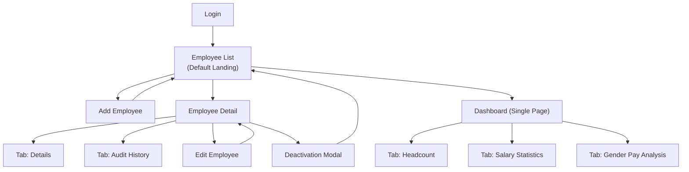

**Total Screens: 7** (Login, Employee List, Add Employee, Employee Detail, Edit Employee, Deactivation Modal, Dashboard — with client-side tabs within Detail and Dashboard)

---

### Screen 1: Login

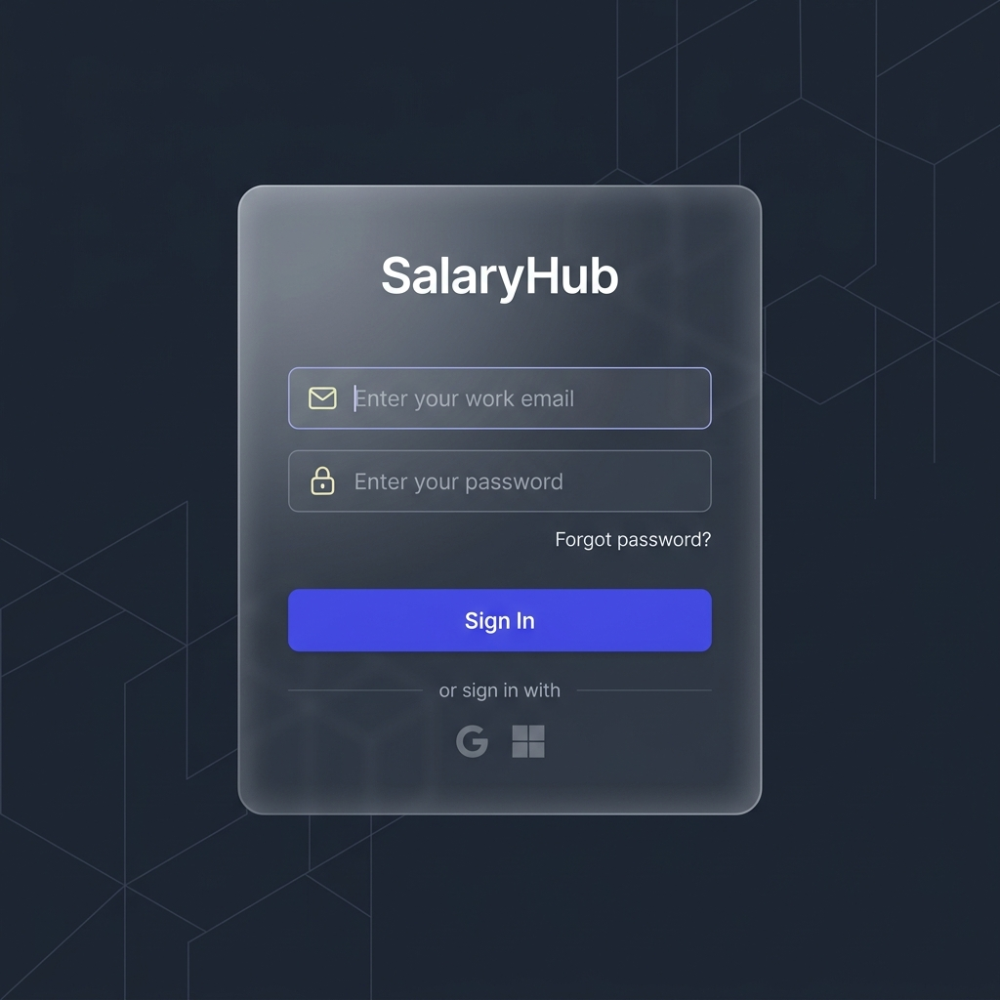

**Screen Inventory:**

| Element | Details |
|---------|---------|
| Logo | "SalaryHub" wordmark, centered above card |
| Card | Frosted glass card (`--bg-secondary` + `backdrop-filter: blur`) |
| Email field | Required, type=email, envelope icon prefix |
| Password field | Required, type=password with visibility toggle, lock icon prefix |
| Sign In button | Primary button, full card width, `--accent-gradient` |
| Error state | Inline error below button: "Invalid email or password" |
| Footer | "Salary Management System v1.0" in `--text-muted` |

**User Flow**: Enter credentials → validate → redirect to **Employee List** (default landing page).

---

### Screen 2: Employee List (Default Landing Page)

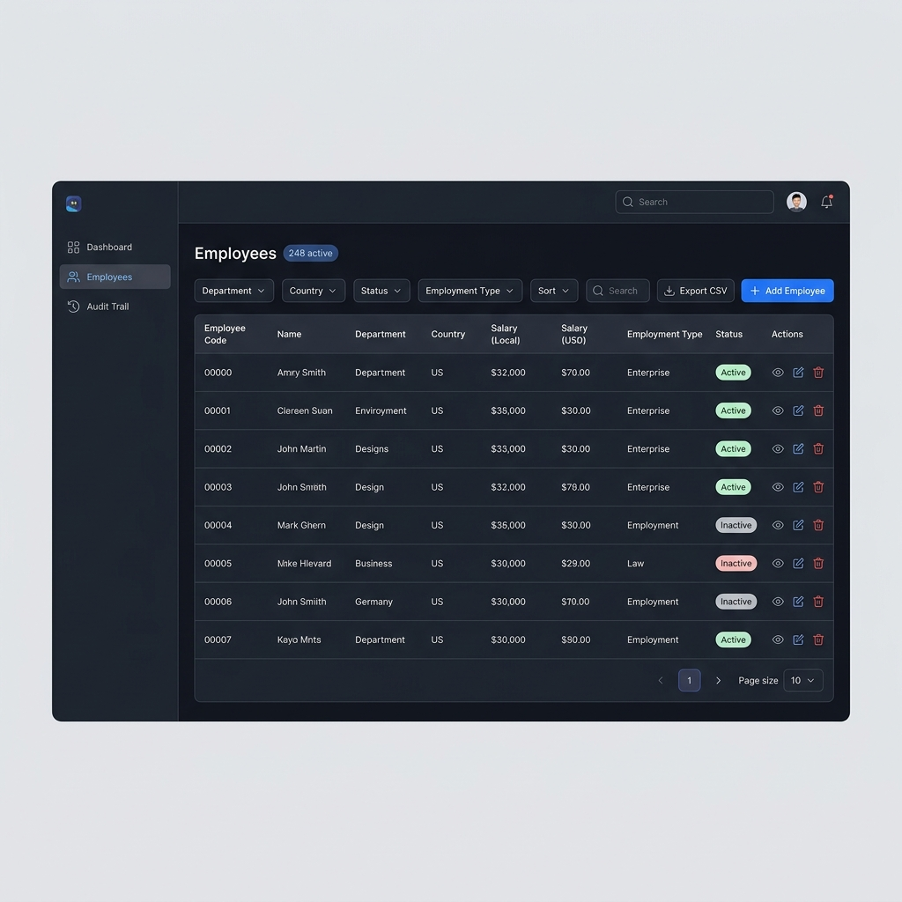

**Screen Inventory:**

| Zone | Elements |
|------|----------|
| **Page Header** | Title "Employees", count badge "248 active", "Add Employee" button (Primary + Plus icon) |
| **Action Bar** | Search input (searches name, email, code), Filter button opening filter panel, Sort dropdown, "Export CSV" button (Secondary + Download icon) |
| **Filter Panel** | Collapsible. Dropdowns: Department, Country, Gender, Employment Type, Status (Active/Inactive/All). "Apply" + "Clear All" buttons |
| **Data Table** | See column spec below |
| **Pagination** | "Showing 1-25 of 248" ∣ Page size selector (10/25/50/100) ∣ Page nav: ◀ 1 2 3 ... 10 ▶ |

**Employee List — Table Columns:**

| Column | Content | Sortable | Notes |
|--------|---------|----------|-------|
| Employee Code | `EMP-0042` (mono font) | No | Unique identifier |
| Name | First + Last Name | Yes (A-Z, Z-A) | Primary display |
| Department | Department name | Yes | From backend lookup |
| Country | Country name | No | |
| Salary (Local) | Formatted with currency symbol, e.g. `₹18,50,000` | Yes (asc/desc) | Currency auto-determined from country |
| Salary (USD) | `$22,000` | Yes (asc/desc) | Always USD |
| Employment Type | Badge: Full-time / Part-time / Contract / Intern | No | |
| Status | Pill badge: Active (green) / Inactive (red) | No | |
| Deactivation Reason | Text or "—" for active employees | No | Only populated for inactive employees. Shows reason like "Resigned", "Terminated" etc. |
| Actions | View (Eye) / Edit (Pencil) / Deactivate (Trash2) icon buttons | No | Deactivate hidden for already-inactive employees |

> **Note:** **Deactivation Reason column**: Visible in the employee table for quick reference. For active employees, the cell shows "—". For inactive employees, it shows the selected reason (e.g., "Resigned"). The detailed free-form text is stored in the audit trail's `reason_for_change` field.

**Key Interactions:**
- Clicking a row → navigates to Employee Detail (Screen 4)
- Column headers with sort icon → toggle sort direction
- Status filter defaults to "Active only"
- Export CSV respects current filters and sort order

---

### Screen 3: Add Employee

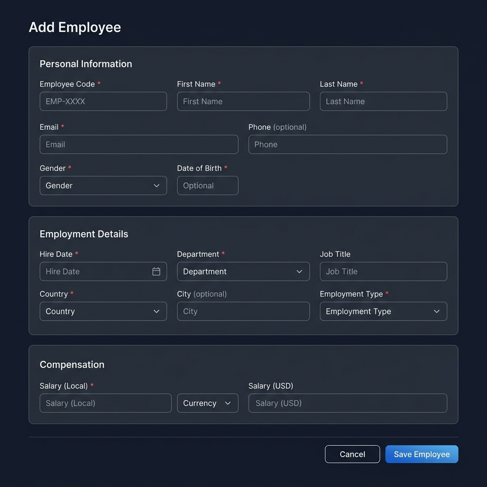

**Screen Inventory:**

| Section | Fields |
|---------|--------|
| **Personal Information** | Employee Code* (text, hint "EMP-XXXX"), First Name*, Last Name*, Email* (type=email), Phone (optional), Gender* (select: Male / Female / Other / Prefer not to say), Date of Birth* (date picker) |
| **Employment Details** | Hire Date* (date picker), Department* (select from backend list), Job Title* (text), Country* (select), City* (text), Employment Type* (select: Full-time / Part-time / Contract / Intern) |
| **Compensation** | Salary (Local)* (number input) with **auto-displayed currency label** (read-only, derived from Country, e.g. "INR"), Salary (USD)* (number input, prefixed with $) |
| **Actions** | Cancel (Secondary button) → back to Employee List ∣ Save Employee (Primary button) |

**Employee Fields:**

| Field | Required | Notes |
|-------|----------|-------|
| Employee Code | ✅ | Unique, org-assigned identifier |
| First Name | ✅ | |
| Last Name | ✅ | |
| Email | ✅ | Must be unique |
| Phone | ❌ | Optional |
| Gender | ✅ | Male / Female / Other / Prefer not to say |
| Date of Birth | ✅ | Mandatory |
| Hire Date | ✅ | |
| Department | ✅ | Select from backend lookup |
| Job Title | ✅ | Free text |
| Country | ✅ | |
| City | ✅ | Mandatory |
| Salary (Local) | ✅ | |
| Currency | 🤖 Auto | Backend auto-determines from Country |
| Salary (USD) | ✅ | |
| Employment Type | ✅ | Full-time / Part-time / Contract / Intern |

> **Important:** **Currency handling**: When the user selects a Country, the currency code is auto-determined by the backend. On the form, a **read-only currency label** appears next to the Salary (Local) input (e.g., selecting "India" shows "INR" as a non-editable badge beside the salary field). There is **no currency dropdown** for the user.

**Compensation Section Layout:**
```
┌─────────────────────────────────────────────────────┐
│  Compensation                                       │
│                                                     │
│  Salary (Local) *                                   │
│  ┌──────────────────────────┐  ┌───────┐            │
│  │  18,50,000               │  │  INR  │  ← auto   │
│  └──────────────────────────┘  └───────┘            │
│                                                     │
│  Salary (USD) *                                     │
│  ┌──────────────────────────┐                       │
│  │  $ 22,000                │                       │
│  └──────────────────────────┘                       │
└─────────────────────────────────────────────────────┘
```

**Explicitly Out of Scope for this form:**
- ❌ Last Pay Review Date
- ❌ Next Pay Review Date
- ❌ Manager / Reports To
- ❌ Currency dropdown (auto-determined)

**Validation Rules:**
- All `*` fields are required — show inline error on blur if empty
- Email must be valid format + unique (async server check)
- Employee Code must be unique (async server check)
- Salary fields must be > 0

**Layout**: Full-page form (not modal) — navigated via breadcrumb: Employees > Add Employee. Each section is a separate card.

---

### Screen 4: Employee Detail (with Tabs)

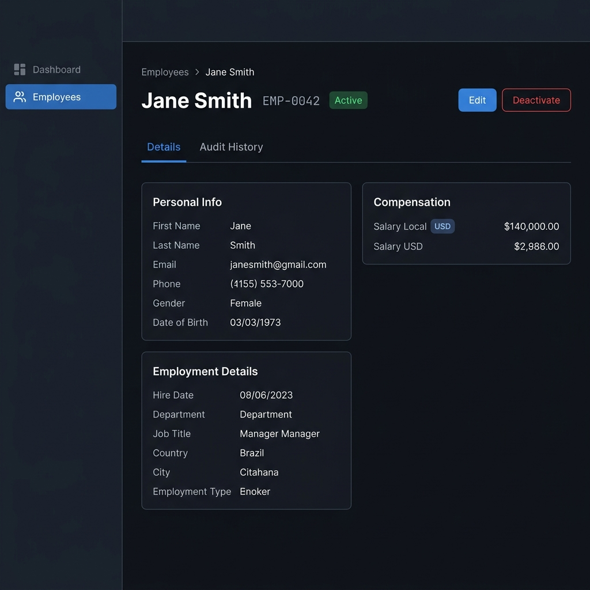

This screen has **two client-side tabs**: **Details** and **Audit History**.

#### Tab Structure:

```
┌──────────────────────────────────────────────────────┐
│  ◀ Employees    Jane Smith   EMP-0042   ● Active     │
│                                    [Edit] [Deactivate]│
├───────────────┬──────────────────────────────────────┤
│  📋 Details   │  🕐 Audit History                    │
│  ─────────────┼──────────────────────────────────────│
│               │                                      │
│   (active tab content renders below)                 │
│                                                      │
└──────────────────────────────────────────────────────┘
```

#### Tab 1: Details

The Details tab shows **only** the employee's current information — no audit history.

| Zone | Elements |
|------|----------|
| **Header** | Breadcrumb (Employees > Jane Smith), Employee name (H1), Employee code (mono, `--text-secondary`), Status badge (Active/Inactive), Action buttons: "Edit" (Primary), "Deactivate" (Danger Outline) |
| **Left Column** | |
| **Personal Info Card** | Employee Code, First Name, Last Name, Email, Phone, Gender, Date of Birth — displayed as label-value pairs in a 2-column grid |
| **Employment Details Card** | Hire Date, Department, Job Title, Country, City, Employment Type |
| **Right Column** | |
| **Compensation Card** | Salary (Local) with currency badge (e.g., `₹18,50,000 INR`), Salary (USD) (e.g., `$22,000`) |

**For inactive employees**: Header shows an amber banner "This employee was deactivated — Reason: Resigned" and the Edit/Deactivate buttons are hidden.

#### Tab 2: Audit History (Table Format)

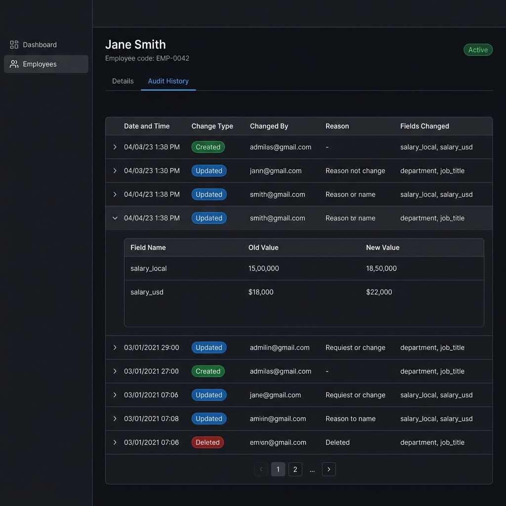

The audit trail is displayed as a **data table** directly — no filters, no filter bar. The table is scoped to the current employee.

**Audit History Table Columns:**

| Column | Content | Notes |
|--------|---------|-------|
| Date & Time | "May 15, 2026, 2:34 PM" | Sorted most recent first (default) |
| Change Type | Badge: Created (green) / Updated (blue) / Deleted (red) | Color-coded badges |
| Changed By | Email of the HR manager | e.g., `john@company.com` |
| Fields Changed | Comma-separated field names | e.g., `salary_local, salary_usd` or `department, job_title`. For "Created" entries: shows "All fields (initial creation)" |
| Reason | Change reason text | Required for updates and deletes |
| Expand | Toggle arrow | Click to expand diff details |

**Expanded "Changes" Column:**

When a row is expanded (click to toggle), it shows a nested diff table:

| Field | Old Value | New Value |
|-------|-----------|-----------|
| salary_local | ₹15,00,000 | ₹18,50,000 |
| salary_usd | $18,000 | $22,000 |

- For **"Created"** entries: Shows all initial field values (no "Old Value" column)
- For **"Deleted"** entries: Shows the deactivation reason and final field state
- For **"Updated"** entries: Shows only the fields that changed with old → new values

---

### Screen 5: Edit Employee

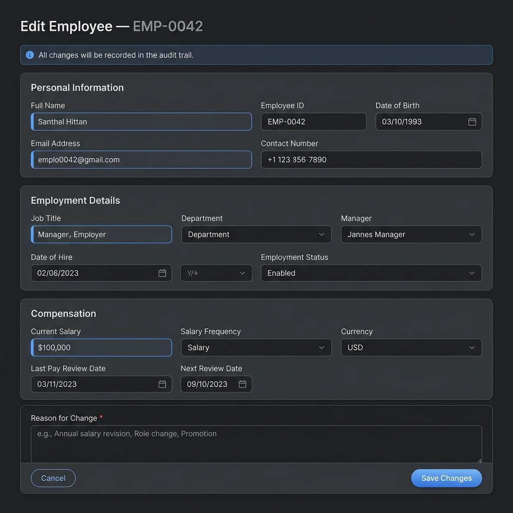

**Screen Inventory:**

| Zone | Elements |
|------|----------|
| **Info Banner** | Blue info strip: "All changes will be recorded in the audit trail" |
| **Title** | "Edit Employee — EMP-0042" with breadcrumb |
| **Form** | Same layout as Add Employee, but all fields pre-filled with existing values. Currency label still auto-determined from Country (if Country changes, currency label updates) |
| **Change Reason** | Required textarea at bottom: label "Reason for Change *", placeholder "e.g., Annual salary revision, Role change, Promotion…" |
| **Actions** | Cancel (Secondary) → back to Employee Detail ∣ Save Changes (Primary) |

**Key Interactions:**
- Form cannot be submitted without a change reason
- If no fields have been modified, "Save Changes" is disabled
- Changed fields get a subtle left-border highlight (`--accent-primary`)
- On save → success toast → redirect to Employee Detail
- If Country changes → currency label auto-updates

**Explicitly excluded fields (not on this form):**
- ❌ Last Pay Review Date
- ❌ Next Pay Review Date
- ❌ Manager / Reports To

---

### Screen 6: Deactivation Modal

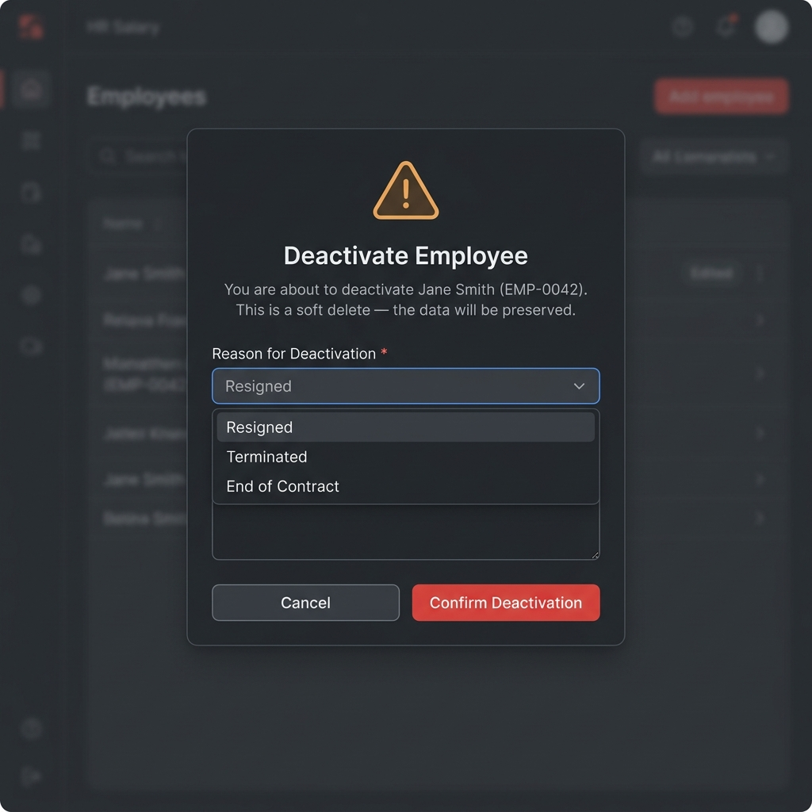

**Screen Inventory:**

| Element | Details |
|---------|---------|
| Overlay | Dark blur overlay |
| Warning Icon | `AlertTriangle` in `--warning`, large (48px) |
| Title | "Deactivate Employee" |
| Subtitle | "You are about to deactivate **{Name}** ({Code}). This is a soft delete — all data will be preserved." |
| Reason dropdown * | Required. Options: "Resigned", "Terminated", "End of Contract", "Layoff", "Other" |
| Additional notes | Optional textarea: "Any additional details…" |
| Actions | Cancel (Secondary) ∣ Confirm Deactivation (Danger button) |

**Data Storage:**

| Data | Stored In | Column |
|------|-----------|--------|
| Selected reason (e.g., "Resigned") | **Employee table** | `deactivation_reason` — new column |
| Free-form additional notes | **Audit table** | `reason_for_change` — existing column |
| Full change record | **Audit table** | Standard audit entry with change_type = "Deleted" |

> **Important:** **Deactivation reason** is stored as a dedicated column on the employee table itself (not just in audit). This allows the Employee List table to display it without querying the audit trail. The optional free-form notes go into the audit trail's `reason_for_change` field as they do for any other update.

**Key Interactions:**
- Modal is keyboard-trapped (focus lock)
- ESC key = Cancel
- Cannot confirm without selecting a reason from the dropdown
- On confirm → success toast → employee status changes to Inactive → redirect to Employee List

---

### Screen 7: Dashboard — Single Page, Three Tabs

The Dashboard is a **single page** (`/dashboard`) with **three client-side tabs**. No separate routes.

```
┌──────────────────────────────────────────────────────┐
│  Dashboard                                           │
├───────────────┬───────────────┬───────────────────────┤
│  📊 Headcount │  💰 Salary    │  ⚖️ Gender Pay        │
│               │   Statistics  │   Analysis            │
│  ─────────────┴───────────────┴───────────────────────│
│                                                      │
│   (active tab content renders below)                 │
│                                                      │
└──────────────────────────────────────────────────────┘
```

---

#### Tab 1: Headcount

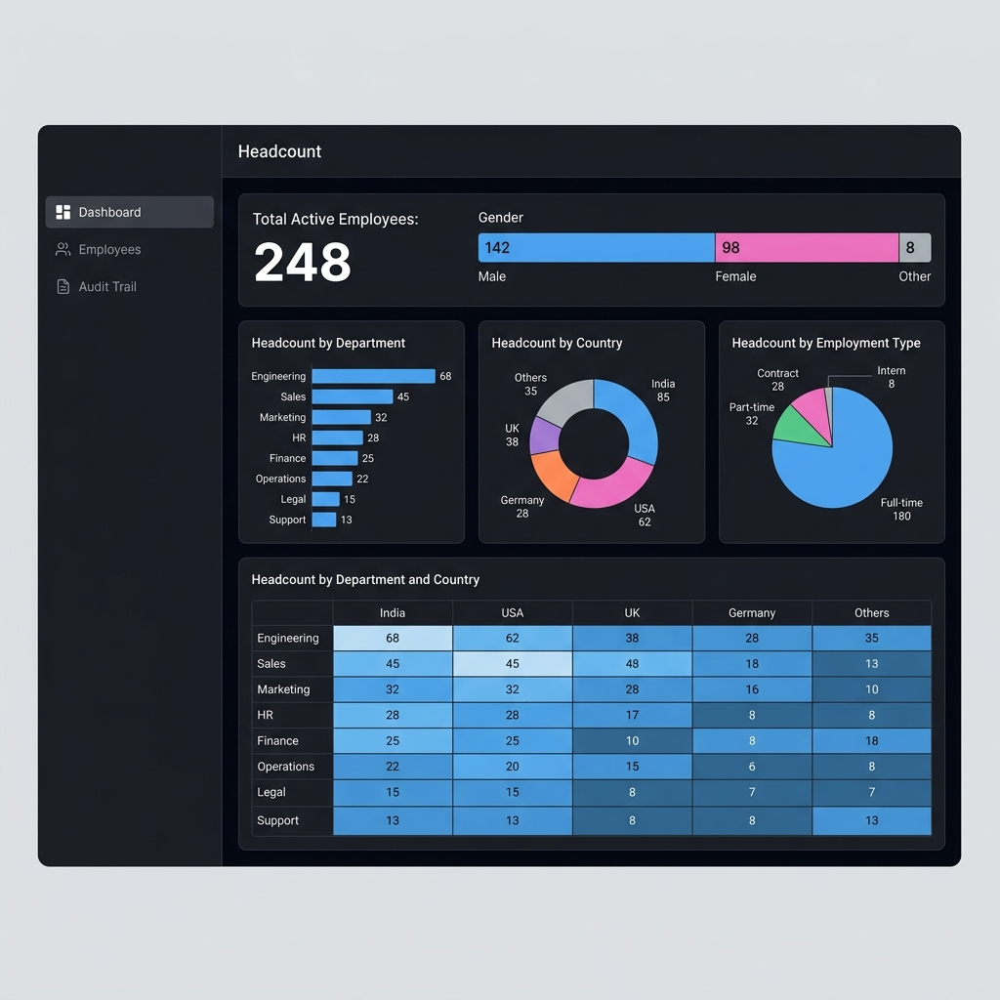

**Layout — All data presented in tables:**

**Section A — Hero Stats (Metric 3.1 + 3.2)**

| Stat | Value |
|------|-------|
| Total Active Employees | **248** (large `--text-display`) |

Gender breakdown displayed as a compact summary table immediately below:

| Gender | Count | % |
|--------|-------|---|
| Male | 142 | 57.3% |
| Female | 98 | 39.5% |
| Other | 5 | 2.0% |
| Prefer not to say | 3 | 1.2% |

---

**Section B — Headcount by Department (Metric 3.3)**

| Department | Headcount | % of Total |
|------------|-----------|------------|
| Engineering | 68 | 27.4% |
| Sales | 45 | 18.1% |
| Marketing | 32 | 12.9% |
| HR | 28 | 11.3% |
| Finance | 25 | 10.1% |
| Operations | 22 | 8.9% |
| Legal | 15 | 6.0% |
| Support | 13 | 5.2% |

---

**Section C — Headcount by Country (Metric 3.4)**

| Country | Headcount | % of Total |
|---------|-----------|------------|
| India | 85 | 34.3% |
| USA | 62 | 25.0% |
| UK | 38 | 15.3% |
| Germany | 28 | 11.3% |
| ... | ... | ... |

---

**Section D — Headcount by Department & Country (Metric 3.5)**

Cross-tab table with departments as rows and countries as columns:

| Department | India | USA | UK | Germany | Total |
|------------|-------|-----|----|---------|-------|
| Engineering | 25 | 20 | 12 | 11 | 68 |
| Sales | 18 | 12 | 8 | 7 | 45 |
| ... | ... | ... | ... | ... | ... |

---

**Section E — Headcount by Job Title & Country (Metric 3.6)**

Same cross-tab format as Section D but with Job Titles as rows.

---

**Section F — Headcount by Employment Type (Metric 3.7)**

| Employment Type | Headcount | % of Total |
|-----------------|-----------|------------|
| Full-time | 180 | 72.6% |
| Part-time | 32 | 12.9% |
| Contract | 28 | 11.3% |
| Intern | 8 | 3.2% |

---

#### Tab 2: Salary Statistics

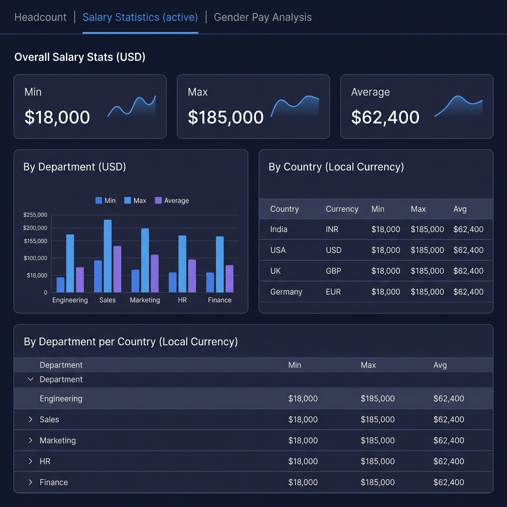

**All salary data in tables. Cross-country = USD. Country-specific = local currency.**

**Section A — Overall (USD) (Metric 3.8)**

Three stat cards in a row:

| Metric | Value |
|--------|-------|
| Minimum | $18,000 |
| Maximum | $185,000 |
| Average | $62,400 |

---

**Section B — By Country (Local Currency) (Metric 3.9)**

| Country | Currency | Min | Max | Average |
|---------|----------|-----|-----|---------|
| India | INR | ₹4,50,000 | ₹45,00,000 | ₹15,60,000 |
| USA | USD | $35,000 | $185,000 | $82,400 |
| UK | GBP | £28,000 | £120,000 | £55,200 |
| Germany | EUR | €32,000 | €130,000 | €61,800 |

---

**Section C — By Department (USD) (Metric 3.10)**

| Department | Min (USD) | Max (USD) | Average (USD) |
|------------|-----------|-----------|---------------|
| Engineering | $28,000 | $185,000 | $78,400 |
| Sales | $22,000 | $145,000 | $65,200 |
| ... | ... | ... | ... |

---

**Section D — By Department, per Country (Local Currency) (Metric 3.11)**

Expandable accordion rows. Click a department → shows country-level breakdown:

| Department | ▼ Expand |
|------------|----------|
| **Engineering** | |

Expanded:

| Country | Currency | Min | Max | Average |
|---------|----------|-----|-----|---------|
| India | INR | ₹6,00,000 | ₹45,00,000 | ₹19,50,000 |
| USA | USD | $45,000 | $185,000 | $95,000 |
| UK | GBP | £35,000 | £120,000 | £62,000 |

---

**Section E — By Job Title (USD) (Metric 3.12)**

| Job Title | Min (USD) | Max (USD) | Average (USD) |
|-----------|-----------|-----------|---------------|
| Software Engineer | $28,000 | $165,000 | $72,400 |
| Product Manager | $35,000 | $185,000 | $88,200 |
| ... | ... | ... | ... |

---

**Section F — By Job Title, per Country (Local Currency) (Metric 3.13)**

Same expandable accordion pattern as Section D, but with Job Titles as the parent rows.

---

#### Tab 3: Gender Pay Analysis

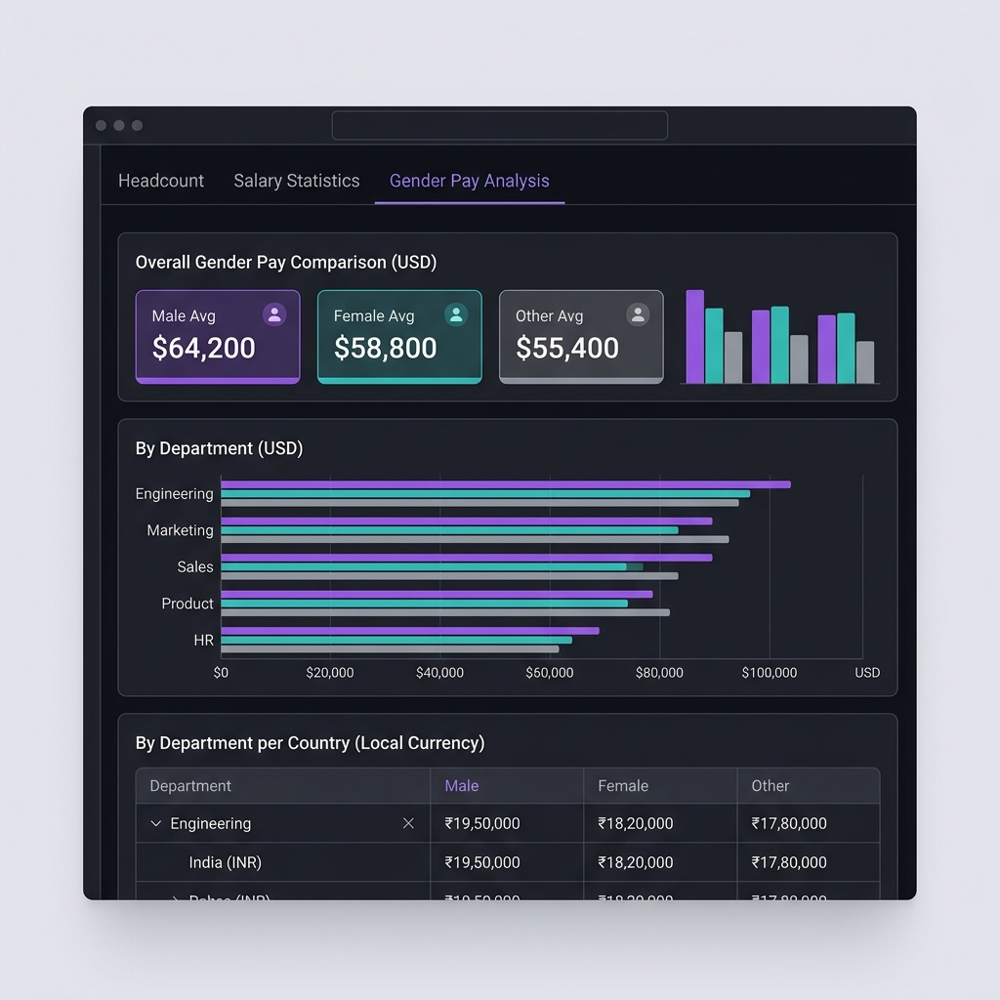

**Section A — Overall (USD) (Metric 3.14)**

| Gender | Avg Salary (USD) |
|--------|-----------------|
| Male | $64,200 |
| Female | $58,800 |
| Other | $55,400 |
| Prefer not to say | $52,000 |

Gender values use their respective color tokens (`--gender-male`, etc.) as left-border accent on each row.

---

**Section B — By Department (USD) (Metric 3.15)**

| Department | Male Avg | Female Avg | Other Avg | PNTS Avg |
|------------|----------|------------|-----------|----------|
| Engineering | $82,000 | $76,500 | $71,200 | — |
| Sales | $68,400 | $62,100 | $58,900 | $55,000 |
| Marketing | $58,200 | $56,800 | — | — |
| ... | ... | ... | ... | ... |

"—" indicates no employees in that gender category for the department.

---

**Section C — By Department, per Country (Local Currency) (Metric 3.16)**

Expandable accordion rows. Click a department → shows country-level gender breakdown:

| Department | ▼ Expand |
|------------|----------|
| **Engineering** | |

Expanded:

| Country | Currency | Male Avg | Female Avg | Other Avg | PNTS Avg |
|---------|----------|----------|------------|-----------|----------|
| India | INR | ₹19,50,000 | ₹18,20,000 | ₹17,80,000 | — |
| USA | USD | $98,000 | $92,500 | $88,000 | — |
| UK | GBP | £65,000 | £61,200 | — | — |

---

## Interaction Patterns

### Loading States

| State | Treatment |
|-------|-----------|
| Page loading | Skeleton screens matching the layout (pulsing `--bg-surface` blocks) |
| Table loading | Skeleton rows (6-8 rows) |
| Tab switching | Instant client-side, no loading (data pre-fetched or lazy-loaded with skeleton) |
| Button loading | Spinner replaces button text, button disabled |
| Inline async validation | Small spinner beside input, then ✓ or ✗ icon |

### Empty States

| Screen | Message | Action |
|--------|---------|--------|
| Employee List (no data) | "No employees yet" | "Add your first employee" CTA |
| Employee List (no filter results) | "No employees match your filters" | "Clear filters" link |
| Audit History tab (no data) | "No changes recorded yet" | — |
| Dashboard (no data) | "Add employees to see analytics" | "Go to Employees" CTA |

### Animations & Transitions

| Interaction | Animation |
|-------------|-----------|
| Page navigation | Fade-in 200ms ease-out |
| Modal open | Scale 0.95→1 + fade-in 200ms |
| Modal close | Fade-out 150ms |
| Sidebar nav hover | Background color 150ms ease |
| Table row hover | Background color 100ms |
| Tab switching | Content fade 150ms, indicator slide 200ms |
| Accordion expand | Height auto + fade 200ms |
| Toast enter | Slide-in from right 300ms + fade |
| Toast exit | Fade-out 200ms |
| Skeleton pulse | Opacity 0.5→1 ping-pong 1.5s |
| Currency label update | Fade 200ms (when country changes in form) |

---

## Responsive Strategy

| Breakpoint | Name | Layout Adjustments |
|------------|------|-------------------|
| ≥1280px | Desktop | Sidebar (240px) + full content area, multi-column card layouts, full table columns visible |
| 1024–1279px | Tablet landscape | Sidebar collapsed to icon-only (64px), content fills remaining width. Dashboard tables scroll horizontally |
| 768–1023px | Tablet portrait | Sidebar hidden (hamburger toggle), dashboard tables stack vertically. Employee form sections stack full-width |
| <768px | Mobile | Full-width layout, employee list table → card list view, form sections full-width, bottom tab bar replaces sidebar. Dashboard cross-tabs scroll horizontally |

**Responsive Table Behavior:**
- Tables exceeding viewport width get horizontal scroll with the first column (row headers) frozen
- On mobile (<768px), the Employee List switches to a **card layout**: each employee is a card showing Name, Code, Department, Status badge, and Salary (USD). Tap to view details.

**Responsive Navigation:**
- **Desktop**: Left sidebar always visible
- **Tablet**: Collapsed icon sidebar, expand on hover/click
- **Mobile**: Bottom tab bar with 2 tabs (Dashboard, Employees) + hamburger for user menu

---

## Accessibility

| Guideline | Implementation |
|-----------|---------------|
| **Color contrast** | All text meets WCAG AA (4.5:1 for body, 3:1 for large text). Tested against dark backgrounds |
| **Focus management** | Visible focus rings (`--border-focus` + `--shadow-glow`) on all interactive elements. Tab order follows visual order |
| **Keyboard navigation** | All actions reachable via keyboard. Modal focus trapping. ESC to close modals/dropdowns. Arrow keys for tab switching |
| **Screen readers** | ARIA labels on icon-only buttons. `role="table"` on data tables. `aria-live="polite"` on toast region. `role="tablist"` / `role="tab"` / `role="tabpanel"` for client-side tabs |
| **Form labels** | Every input has an associated `<label>`. Required fields have `aria-required="true"`. Error messages linked via `aria-describedby`. Auto-determined currency has `aria-label="Currency determined by country selection"` |
| **Motion** | Respect `prefers-reduced-motion` — disable all animations when set |
| **Semantic HTML** | `<nav>`, `<main>`, `<aside>`, `<header>`, `<footer>`, `<section>`, `<article>` used appropriately |

---

## Summary of All Screens

| # | Screen | Route | Type | Key Interaction |
|---|--------|-------|------|-----------------|
| 1 | Login | `/login` | Page | Auth → redirect to Employee List |
| 2 | Employee List | `/employees` | Page (default landing) | Filter, sort, paginate, export CSV, CRUD actions |
| 3 | Add Employee | `/employees/new` | Page | Multi-section form, currency auto-determined |
| 4 | Employee Detail | `/employees/:id` | Page + 2 tabs | Tab 1: Details view. Tab 2: Audit History table |
| 5 | Edit Employee | `/employees/:id/edit` | Page | Pre-filled form + mandatory change reason |
| 6 | Deactivation Modal | (overlay on Detail/List) | Modal | Reason dropdown → stored in employee table |
| 7 | Dashboard | `/dashboard` | Page + 3 tabs | Tab 1: Headcount. Tab 2: Salary Stats. Tab 3: Gender Pay |
